# INSTITUTO DE EDUCACIÓN SUPERIOR TECNOLÓGICO PÚBLICO
## PROGRAMA DE ESTUDIOS: ARQUITECTURA DE PLATAFORMAS Y SERVICIOS DE TI
### ACTIVIDAD DE APRENDIZAJE: DESARROLLO DE SESIÓN

---

* **DOCENTE:** Dr. Javier Eduardo Jaramillo Atoche
* **INTEGRANTES:**
  - Gerson Misael Pintado Huamán
  - Manuel Danilo López Garay
  - Mariana Juliet Clavijo Pinzón
  - Pedro Miguel Aguilar Flores
  - Dayron Antonio Urbina Zapata
* **SEDE Y FECHA:** Paita, Piura – Ciclo Lectivo 2026
* **TEMA:**
  1. Caso Práctico: Seguridad Física y Lógica en un Data Center
  2. Mapa Conceptual del Tema (Normas ISO/IEC 27001 y ANSI/TIA-942)

---

# ACTIVIDAD 1: CASO PRÁCTICO DE SEGURIDAD FÍSICA Y LÓGICA EN UN DATA CENTER

### 1.1 Presentación del Caso: Data Center de «FinanSur Data Cloud S.A.C.»
«FinanSur Data Cloud S.A.C.» es una compañía proveedora de infraestructura informática y pasarela de pagos electrónicos para entidades bancarias, cooperativas y empresas de exportación de la zona norte. Su centro de datos principal administra 10 racks con servidores de aplicaciones, bases de datos transaccionales y almacenamiento en red (SAN/NAS).

El Data Center procesa un promedio de 85,000 transacciones diarias. Hasta hace tres meses, la empresa operaba bajo un esquema informal de seguridad que dependía de la confianza en el personal y de configuraciones básicas de fábrica, sin apego a estándares formales como ISO/IEC 27001 ni ANSI/TIA-942.

---

### 1.2 Descripción del Incidente y Problemática Operativa
El pasado 14 de agosto a las 11:20 a.m. se produjo un corte intempestivo del suministro eléctrico en la zona industrial. De inmediato se desencadenaron las siguientes contingencias críticas:
* **Fallo de Energía y Contingencia Térmica:** El banco de UPS monofásicos, con baterías degradadas por falta de mantenimiento, solo soportó 7 minutos de carga antes de apagarse. El grupo electrógeno diésel exterior no arrancó de forma automática porque el conmutador de transferencia (ATS) se encontraba en modo manual desde una prueba previa no reportada. La sala quedó a oscuras y los aires acondicionados convencionales de pared se detuvieron, provocando una subida de temperatura de 21°C a 39°C en 25 minutos, activando las alarmas térmicas de los procesadores.
* **Violación de Seguridad Física Perimetral:** Durante la desesperación del corte, las puertas de la sala técnica se mantuvieron abiertas para ventilar el calor con ventiladores de pedestal. Personal de limpieza y contratistas externos ingresaron a la sala de servidores sin registro de bitácora ni gafete identificatorio, transitando libremente frente a los racks.
* **Incidente de Seguridad Lógica y Acceso No Autorizado:** Al restablecerse el fluido eléctrico, se detectó que un servidor de base de datos presentaba un consumo inusitado del 100% de CPU. El análisis forense reveló que un atacante externo había aprovechado que el puerto RDP (3389) estaba abierto directamente hacia Internet sin VPN ni autenticación multifactor (MFA). El atacante ejecutó un ataque de fuerza bruta sobre la cuenta genérica «Administrador», logró acceso e inyectó un script malicioso en la memoria antes de ser desconectado.
* **Consecuencias Económicas y Operativas:** La caída total de los servicios se extendió por 6 horas y media, provocando el retraso de liquidaciones bancarias, penalidades contractuales por S/. 48,000 y pérdida de confianza por parte de dos clientes corporativos.

---

### 1.3 Cuestionario de Análisis del Caso Práctico

#### Pregunta 1: ¿Cuáles fueron las principales fallas de seguridad física identificadas?
* **Respuesta:**
  1. Falta de control de acceso estricto (puertas abiertas sin esclusa de seguridad ni biometría).
  2. Ausencia de bitácora obligatoria de visitas y proveedores externos.
  3. Climatización doméstica inadecuada (equipos split sin control de humedad ni redundancia N+1).
  4. Sistema de energía vulnerable (UPS sin autonomía certificada, generador sin conmutación automática ATS funcional).
  5. Rociadores de agua instalados sobre racks que ponían en riesgo de cortocircuito los equipos.

#### Pregunta 2: ¿Cuáles fueron las principales brechas de seguridad lógica encontradas?
* **Respuesta:**
  1. Ausencia de segmentación de red (los servidores compartían la misma subred que las PCs de oficina y el WiFi).
  2. Exposición directa de puertos críticos de gestión (RDP 3389) a la red pública Internet sin túnel VPN.
  3. Empleo de cuentas genéricas («Administrador») con contraseñas vulnerables y sin rotación.
  4. Inexistencia de autenticación multifactor (MFA/2FA) para accesos privilegiados.
  5. Inexistencia de copias de seguridad inmutables protegidas contra malware y Ransomware.
  6. Falta de un sistema centralizado de logs (SIEM) para detectar intrusiones en tiempo real.

#### Pregunta 3: ¿Qué normas y estándares internacionales deben aplicarse para solucionar el problema?
* **Respuesta:**
  1. **ANSI/TIA-942 (Telecommunications Infrastructure Standard for Data Centers):** Establece el diseño de salas técnicas bajo niveles Tier. Para este caso se adopta el estándar **Tier III (Mantenimiento Concurrente)**, garantizando rutas de energía y climatización redundantes (N+1) con 99.982% de disponibilidad anual.
  2. **ISO/IEC 27001 (Sistema de Gestión de Seguridad de la Información):** Aplica los controles de seguridad física del entorno (Cláusula A.7: perímetros de seguridad física, controles de acceso, protección contra amenazas externas y ambientales) y de seguridad de operaciones y redes (Cláusula A.8: gestión de vulnerabilidades, copias de seguridad, segmentación de redes y controles criptográficos).

---

### 1.4 Plan Integral de Soluciones Técnicas Propuestas

#### A. Soluciones en Seguridad Física (Instalaciones y Entorno)
1. **Control de Acceso Biométrico y Esclusa Mantrap:** Implementación de un sistema de doble puerta interbloqueada (Mantrap) que impide que ambas puertas se abran a la vez. El ingreso exige identificación por tarjeta RFID cifrada y biometría dactilar o facial, registrando automáticamente el historial de accesos en una base de datos inalterable.
2. **Climatización de Precisión y Confinamiento de Pasillos:** Instalación de dos unidades de aire acondicionado de precisión con configuración redundante N+1. Se implementa confinamiento de pasillo frío para garantizar temperatura entre 18°C y 22°C y humedad entre 40% y 60%, con sensores de alarma por inundación bajo el piso técnico.
3. **Protección Contra Incendios con Agente Limpio (Novec 1230):** Desmantelamiento de los rociadores de agua en la sala técnica. Se instala un sistema de detección temprana por aspiración de humo (VESDA) con extinción automática mediante gas limpio Novec 1230 o FM-200, inocuo para los equipos electrónicos y sin residuo.
4. **Infraestructura Eléctrica Redundante (Tier III):** Incorporación de dos acometidas eléctricas (A y B), banco de UPS trifásico modular de doble conversión con autonomía de 45 minutos y conmutador ATS certificado que arranca el grupo electrógeno en menos de 10 segundos ante fallas de la red pública.
5. **Videovigilancia CCTV HD 24/7:** Instalación de cámaras IP fijas y domos en todos los ángulos de la sala y accesos, con grabación continua y retención mínima de 90 días en servidor de video aislado.

#### B. Soluciones en Seguridad Lógica (Redes, Sistemas y Datos)
1. **Segmentación de Redes (VLANs / DMZ) y Firewall NGFW:** Despliegue de un Firewall de Nueva Generación en clúster activo-pasivo. Se segmenta la red mediante VLANs dedicadas: VLAN Gestión, VLAN Base de Datos, VLAN Servidores Web (DMZ) y VLAN Usuarios, bloqueando todo tráfico entre segmentos por defecto.
2. **Gestión de Identidades (IAM) y Autenticación Multifactor (MFA):** Obligatoriedad de token de segundo factor (MFA) para todo acceso a consolas de administración. Se aplica el principio de menor privilegio (RBAC), eliminando las cuentas compartidas y exigiendo credenciales nominativas.
3. **Acceso Remoto Exclusivo por VPN Cifrada:** Cierre de todos los puertos directos a Internet (RDP, SSH, SMB). Todo acceso para soporte técnico remoto se canaliza a través de una VPN SSL con túnel cifrado AES-256.
4. **Detección de Intrusos (IDS/IPS) y Correlación de Eventos (SIEM):** Activación de firmas de prevención de intrusos para bloquear escaneos de puertos y ataques web automáticamente. Los registros de todos los servidores y firewalls se envían a un servidor SIEM para monitoreo 24/7.
5. **Estrategia de Backup 3-2-1 con Inmutabilidad (Anti-Ransomware):** Se generan 3 copias de los datos críticos, en 2 medios distintos (almacenamiento local SAN y repositorio en la nube cifrado), con 1 copia fuera de línea e inmutable (WORM), garantizando la recuperación ante incidentes de secuestro de datos.

---

### 1.5 Matriz de Control de Riesgos y Resultados Esperados

| Vulnerabilidad Detectada | Control Físico Aplicado | Control Lógico Aplicado | Resultado e Impacto |
| :--- | :--- | :--- | :--- |
| **Ingreso no autorizado de personas** | Esclusa Mantrap con biometría dactilar/facial y CCTV 24/7. | Bloqueo automático de sesiones inactivas y log en SIEM. | Cero ingresos indebidos; registro del 100% de accesos. |
| **Corte de energía e interrupción de servicios** | UPS modular trifásico N+1 y generador diésel con ATS automático. | Scripts de apagado ordenado automatizado si se agota la batería. | Disponibilidad 99.98% (SLA cumplido sin caídas no planeadas). |
| **Ataque de fuerza bruta por puerto RDP** | Cerradura de seguridad en puertas frontales y posteriores de racks. | Firewall NGFW, cierre de puertos, VPN obligatoria y MFA activo. | Bloqueo total de conexiones directas; neutralización de intrusiones. |
| **Riesgo de sobrecalentamiento e incendio** | Aire de precisión N+1 pasillo frío y extinción por gas Novec 1230. | Monitoreo de temperatura por SNMP con alertas automáticas (SMS/Mail). | Preservación íntegra del hardware ante emergencias térmicas. |

---

# ACTIVIDAD 2: MAPA CONCEPTUAL DE SEGURIDAD EN UN DATA CENTER

### 2.1 Diagrama del Mapa Conceptual

```mermaid
graph TD
    DC["SEGURIDAD INTEGRAL EN UN DATA CENTER<br>(Tríada CID: Confidencialidad, Integridad y Disponibilidad)"]
    
    %% Ramas de Nivel 2
    DC --> SF["1. SEGURIDAD FÍSICA<br>(Instalaciones, Hardware y Entorno Ambiental)"]
    DC --> SL["2. SEGURIDAD LÓGICA<br>(Redes, Datos, Sistemas y Accesos Virtuales)"]

    %% Ramas de Nivel 3 - Seguridad Física
    SF --> SF1["Control de Acceso Perimetral<br>• Esclusas de paso interbloqueadas (Mantrap)<br>• Autenticación biométrica (Huella/Facial) + RFID<br>• Bitácora digital de visitas obligatoria"]
    SF --> SF2["Videovigilancia y Sensores (CCTV)<br>• Cámaras IP HD 24/7 con infrarrojos<br>• Sensores de apertura en racks<br>• Retención mínima de 90 días"]
    SF --> SF3["Climatización de Precisión (HVAC)<br>• Confinamiento de pasillos frío / caliente<br>• Temperatura: 18°C a 22°C | Humedad: 40%-60%<br>• Sensores de fuga de líquidos en piso técnico"]
    SF --> SF4["Protección Contra Incendios<br>• Detección ultra temprana por humo (VESDA)<br>• Extinción automática con gas limpio (Novec 1230)<br>• Prohibición absoluta de rociadores de agua"]
    SF --> SF5["Respaldo Eléctrico Continuo (Tier III)<br>• Doble acometida eléctrica (Rutas A y B)<br>• UPS modular trifásico de doble conversión<br>• Generador diésel con conmutación ATS"]

    %% Ramas de Nivel 3 - Seguridad Lógica
    SL --> SL1["Seguridad Perimetral y Redes<br>• Firewalls NGFW en alta disponibilidad<br>• Segmentación por VLANs y DMZ aisladas<br>• Acceso remoto exclusivo por VPN (IPsec/SSL)"]
    SL --> SL2["Gestión de Identidad y Accesos (IAM)<br>• Autenticación Multifactor (MFA/2FA) obligatoria<br>• Principio de Menor Privilegio (RBAC)<br>• Eliminación de cuentas genéricas compartidas"]
    SL --> SL3["Detección y Monitoreo (SOC / SIEM)<br>• Detección y prevención de intrusos (IDS/IPS)<br>• Correlación centralizada de logs 24/7 (SIEM)<br>• Respuesta automatizada ante anomalías"]
    SL --> SL4["Cifrado y Protección de Información<br>• Cifrado en reposo (AES-256) para discos y BD<br>• Cifrado en tránsito (TLS 1.3 / HTTPS)<br>• Soluciones de prevención de fugas (DLP)"]
    SL --> SL5["Continuidad Operativa y Respaldos (DRP)<br>• Estrategia de Backup 3-2-1 con copias Cloud<br>• Almacenamiento inmutable WORM anti-ransomware<br>• Plan de Recuperación ante Desastres (DRP)"]
```

---

### 2.2 Glosario Técnico de Términos del Mapa Conceptual

1. **Esclusa (Mantrap):** Sistema de control de acceso físico con dos puertas interbloqueadas donde una no puede abrirse si la otra no está totalmente cerrada.
2. **VESDA:** Sistema de detección de humo por aspiración de muy alta sensibilidad que detecta partículas microscópicas antes de que aparezca llama abierta.
3. **Novec 1230 / FM-200:** Gases limpios de extinción que sofocan el fuego absorbiendo el calor sin dejar residuos, sin ser conductores de electricidad y sin dañar la electrónica.
4. **Conmutador ATS:** Interruptor de transferencia automática que detecta la caída de la energía pública y enciende el generador diésel transfiriendo la carga sin intervención humana.
5. **Firewall NGFW:** Cortafuegos de nueva generación que analiza el tráfico a nivel de aplicación (Capa 7), integrando antivirus, prevención de intrusos (IPS) y filtrado web.
6. **Autenticación MFA / 2FA:** Mecanismo de seguridad que exige al menos dos factores distintos para validar la identidad (algo que sabe: contraseña, y algo que tiene: token/código).
7. **Inmutabilidad WORM:** Propiedad de almacenamiento (Write Once, Read Many) que impide que una copia de respaldo sea modificada, sobreescrita o borrada por un ataque de Ransomware.

---

## CONCLUSIONES Y RECOMENDACIONES GENERALES

1. **Indisociabilidad de Ambas Dimensiones:** La seguridad física y la seguridad lógica son dos caras de la misma moneda. Blindar la red con firewalls y cifrado resulta estéril si cualquier persona puede ingresar a la sala y desconectar un servidor; de igual modo, un centro acorazado con biometría es inútil si los puertos de administración están abiertos a Internet sin protección.
2. **Criterio de Redundancia y Continuidad (Tier III):** En centros de cómputo que manejan operaciones críticas, no debe existir ningún punto único de falla (SPOF - Single Point of Failure). La duplicidad de rutas eléctricas (UPS y generadores) y la climatización N+1 son requisitos indispensables para cumplir con los acuerdos de nivel de servicio (SLA).
3. **Evolución hacia la Inmutabilidad de los Datos:** Frente al crecimiento de amenazas avanzadas como el Ransomware corporativo, las copias de seguridad tradicionales son insuficientes. Es mandatorio implementar esquemas de respaldo inmutables (WORM) y almacenamiento fuera de línea bajo la regla 3-2-1.
4. **Mantenimiento y Auditoría Periódica:** La seguridad de un Data Center no concluye con la compra de equipos; exige pruebas periódicas de arranque de generadores, simulacros de contingencia, revisión semanal de bitácoras de acceso y auditorías continuas bajo la norma ISO/IEC 27001.
